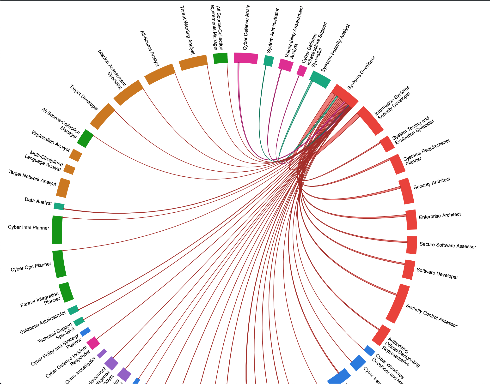

cwfviz
=======

A dockerized set of services ([Neo4j](https://neo4j.com/), [cwf2neo](https://cwf2neo.readthedocs.io/en/latest/index.html), [nodejs](https://nodejs.org/en/), [D3js](https://d3js.org/)) used to generate visualizations related to the [NICE Cybersecurity Workforce Framework](https://www.nist.gov/itl/applied-cybersecurity/nice/resources/nice-cybersecurity-workforce-framework).

----

# Current Visualizations

#### NICE Workroles related by KSATs (Chord Diagram)

Chord width corresponds to the number of related KSATs between two Workroles.
See the [interactive example](https://bl.ocks.org/sintax1/raw/a47d7fe4de12e9485d74fdcf10d78364/)

  

